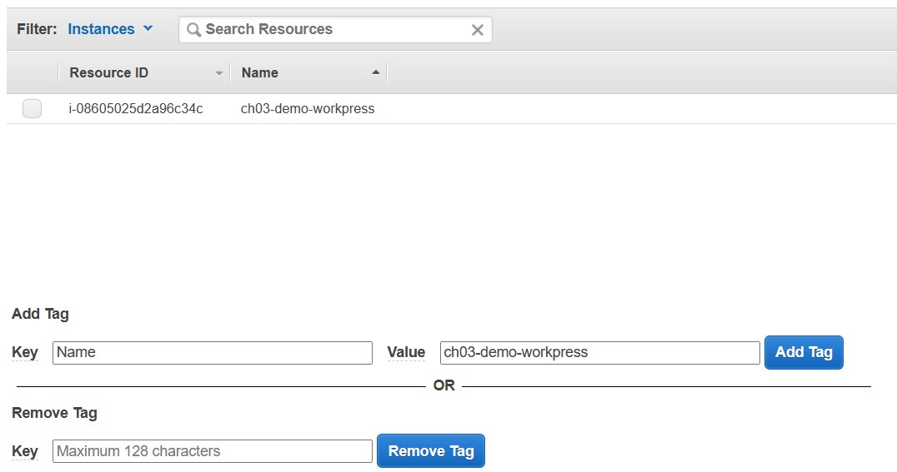
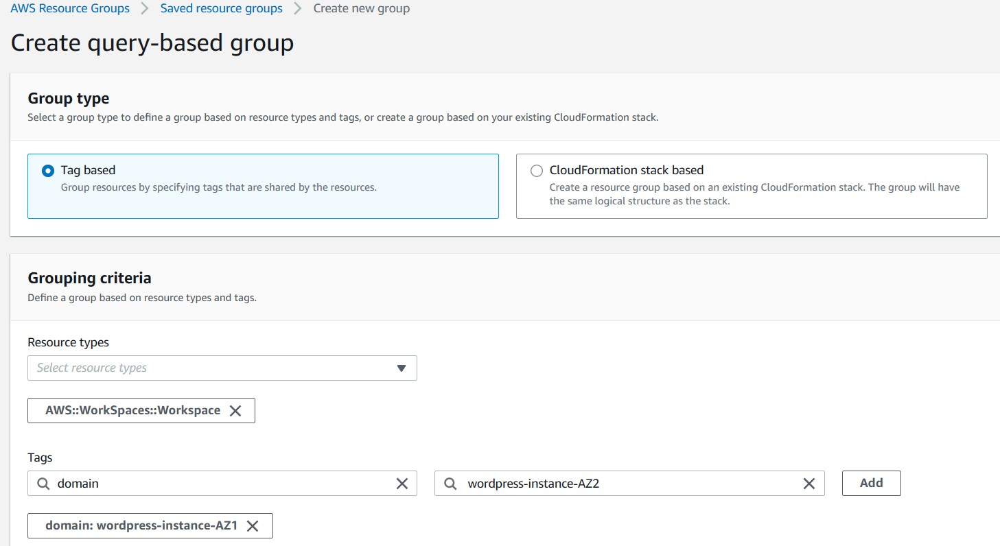
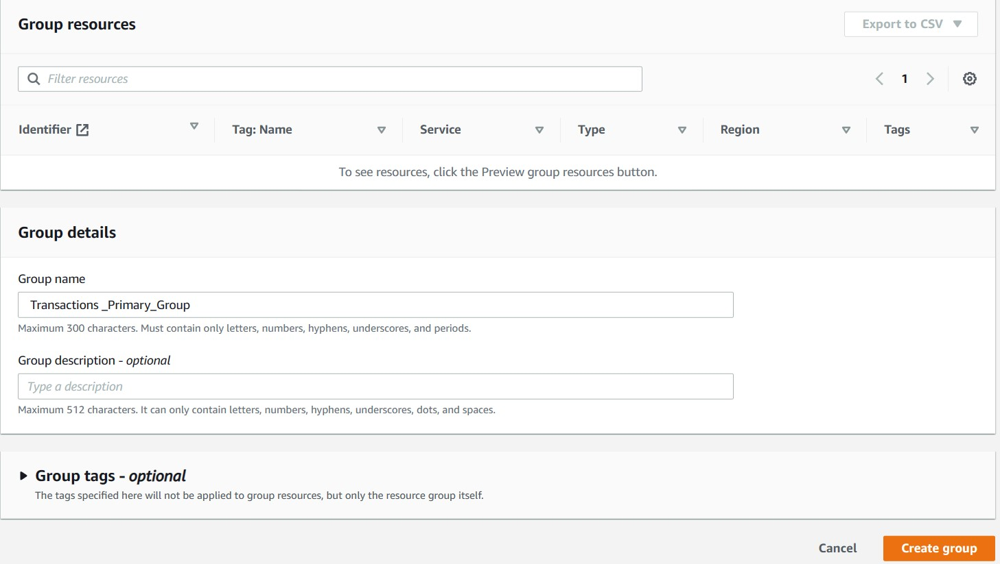
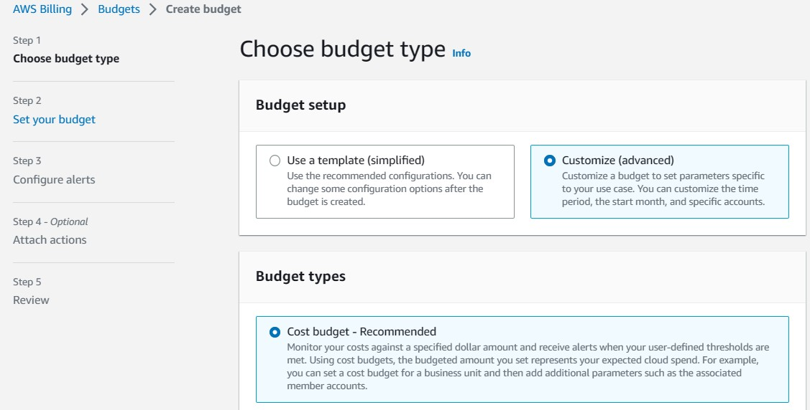
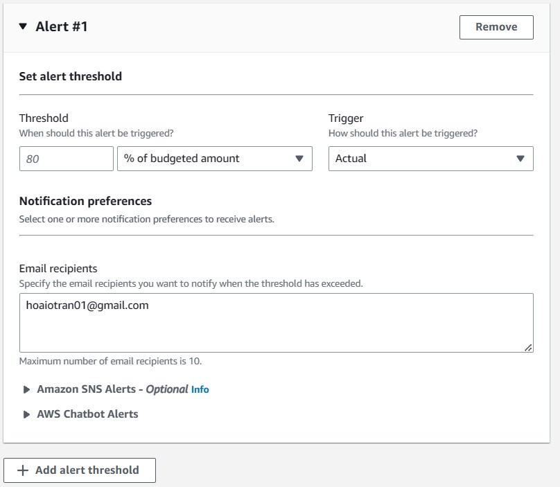
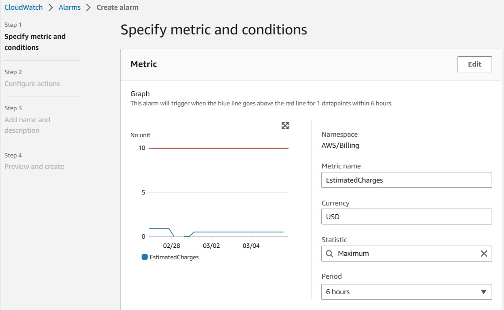
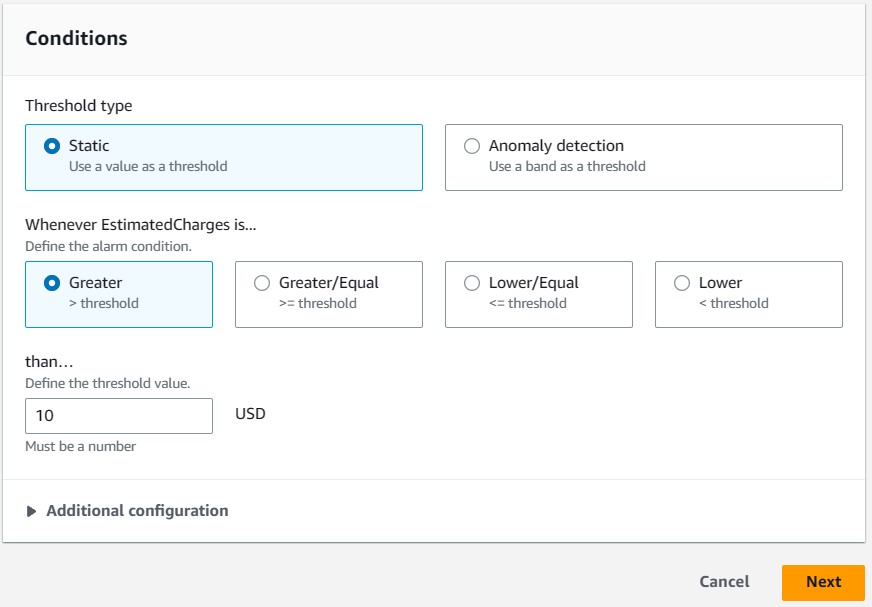
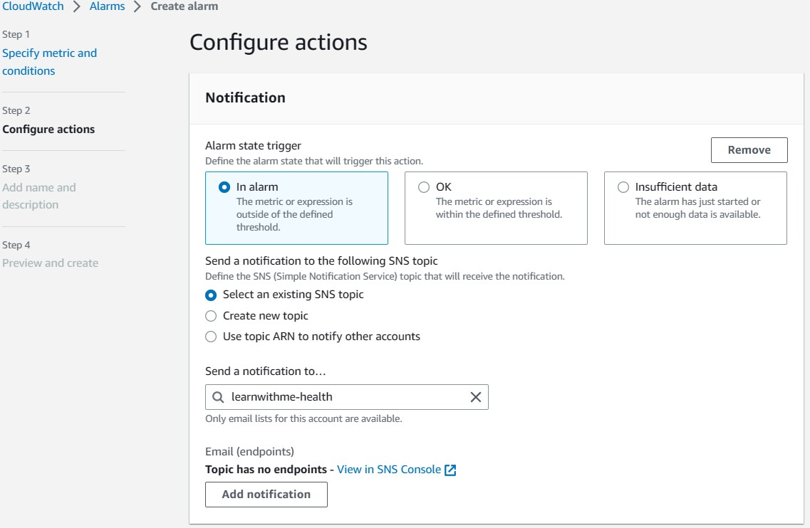
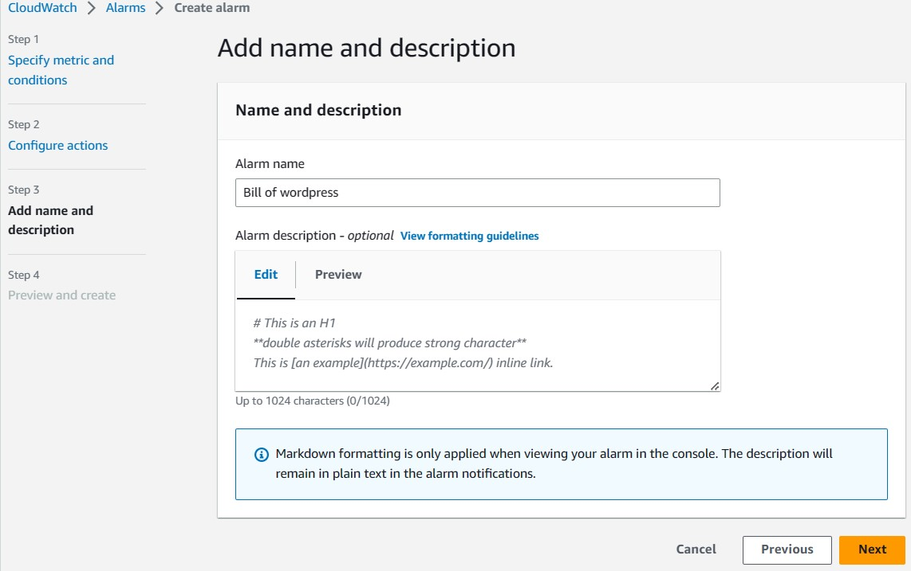

# Pushing back against the chaos: using resource tags
## 10.1 What are resource tags?
A key/value pair, by the way, is a couple of text strings used to
help identify an object’s purpose and context.

The Group Name column can be helpful—it identifies groups created for AWS’s Relational Database Service (RDS), for instance—but look at all those Launch-wizard-x items. Without wasting significant time digging yourself deep into a dark pit of nested menus, do you have any idea which of these may require editing or are safe to remove? Tags can help.

## 10.2 Working with resource tags
### 10.2.1 Creating and applying a tag

### 10.2.2 Designing a naming scheme
Of course, you can come up with much better naming schemes. Let’s
say your company has grown from a single WordPress server to include
backup WordPress instances, servers handling online product sales
transactions (including an RDS database instance), and a staging site
where your developers can safely play with experimental code. Creating
three sets of key tags, each using the key domain and values that include
wordpress, transactions, and staging, could give you a naming
scheme like that shown in table 10.1.

|Key | Value | Explanation|
|----| ------|------------|
|domain| wordpress-instance-AZ1 |WordPress instance running in availability zone 1|
|domain| wordpress-instance-AZ2 |WordPress instance running in availability zone 2|
|domain| transactions-primary |Primary transactions server|
|domain| transactions-backup |Backup transactions server|
|domain| transactions-rds |Transactions RDS server|
|domain| staging-instance-primary |Primary staging server|
|domain| staging-s3-snapshots |S3 bucket where snapshots of the staging server are stored|

The idea is that you can apply these names to every piece of infrastructure in your account. Thus, you could give variations of the domain/transactions-primary key/value pair to an EC2 instance, a
security group, and an S3 bucket that are associated with the primary
transactions server. This would make them easy to find when searching
through your resources by filtering for those keywords.

### 10.2.3 Searching your tagged resources

## 10.3 Working with resource groups
Tags are just the beginning. You can also create resource groups that
use tags to associate resources from across your account. To do so, click
the Resource Groups drop-down (the same one you use to reach the
Tag Editor), and then click Create a Resource Group.

### 10.3.1 Using tags to track costs
One of the most common uses for tags and resource groups is cost
tracking. The ability to slice and dice many resources is such a great way
to productively visualize what you’ve got running, so it stands to reason
that you’ll probably want to link those visualizations with the way you
monitor—and control—spending.

## 11.2 CloudWatch
Amazon CloudWatch is the
engine that drives AWS Budgets. The connection will become clear
once I show you some of CloudWatch’s native functionality. In addition
### 11.2.1 CloudWatch billing alerts

### 11.2.2 CloudWatch usage alerts
CloudWatch alerts to monitoring performance as well as
costs. I’ll use a quick example to illustrate.
Suppose you have a number of virtual machine instances running
that access various EBS storage volumes. You want to make sure the
number of volumes is appropriate to the actual demand they face. To
do that, you can create alarms based on the `VolumeIdleTime` value of
each volume you’re watching.

As you might guess, `VolumeIdleTime` measures stretches of time (in
seconds) through which an EBS volume has no requested read or write
operations. If the number is too high, it may be time to retire a volume
or two. Too low? Perhaps you should add one or more new volumes.
Either way, receiving an alert telling you what’s going on can help you
make timely decisions.